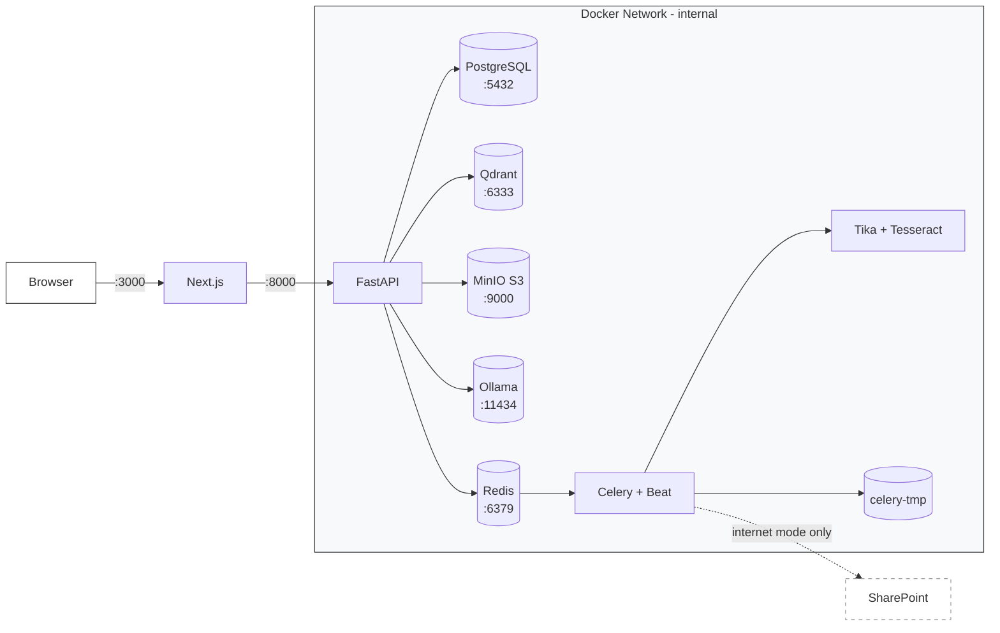
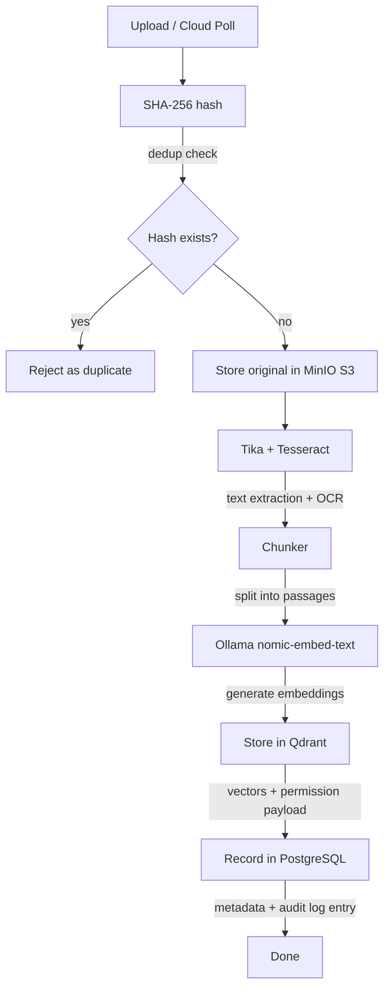
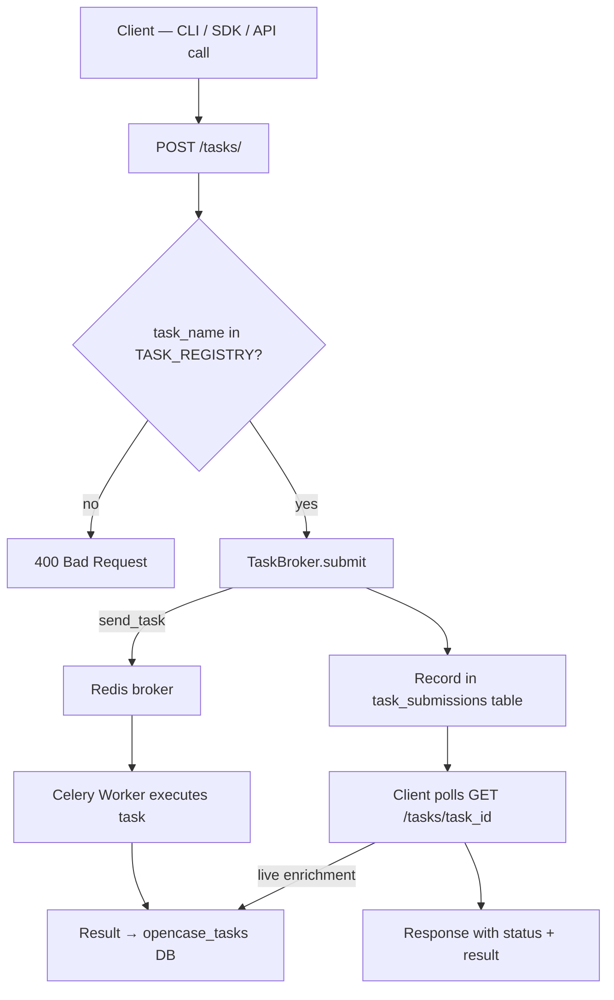
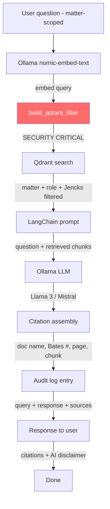

# OpenCase Architecture

## Deployment Model

Single-tenant. One OpenCase instance per firm. Two modes:

- **Air-gapped**: manual upload only, no external network
  calls
- **Internet-accessible**: firm-controlled server or private
  cloud VPC; enables optional scheduled cloud storage
  ingestion

## Service Topology



### Services

| Service | Role | Port |
| --- | --- | --- |
| **Next.js** | UI, session mgmt, httpOnly cookie auth, proxies to FastAPI | 3000 |
| **FastAPI** | API, JWT auth, RBAC, audit logging, LangChain RAG | 8000 (internal) |
| **MinIO** | S3-compatible object store for original documents | 9000 (internal) |
| **Ollama** | Local LLM + embeddings (Llama 3 8B / Mistral 7B; nomic-embed-text) | 11434 (internal) |
| **PostgreSQL** | Relational store — matters, documents, users, audit log | 5432 (internal) |
| **Qdrant** | Vector store — single collection, permission-filtered | 6333, 6334/gRPC (internal) |
| **Redis** | Task queue (Celery broker) + cache | 6379 (internal) |
| **Celery + Beat** | Background workers — ingestion, deadlines, audit, legal hold | N/A |
| **Grafana otel-lgtm** | Observability — traces (Tempo), metrics (Prometheus), logs (Loki), UI (Grafana) | 3001 |

**FastAPI is never exposed on a public port.**
Only Next.js can reach it from inside the Docker network.

**LangChain runs inside FastAPI as a library** — not a
separate service.

Only port **3000** (Next.js) is exposed to the host.
All other services communicate over the internal Docker
network.

## Backend Module Structure

```text
backend/
├── app/
│   ├── api/            # FastAPI routers
│   │   ├── auth.py
│   │   ├── matters.py
│   │   ├── documents.py
│   │   ├── tasks.py
│   │   ├── chatbot.py
│   │   ├── brady.py
│   │   └── admin.py
│   ├── core/           # Cross-cutting concerns
│   │   ├── auth.py           # JWT, MFA
│   │   ├── permissions.py    # build_qdrant_filter()
│   │   └── audit.py          # Hash-chained audit log
│   ├── rag/            # LangChain RAG pipeline
│   │   ├── pipeline.py
│   │   ├── embedder.py
│   │   └── citations.py
│   ├── storage/        # Document object storage
│   │   └── s3.py             # MinIO S3 client
│   ├── ingestion/      # Document processing
│   │   ├── parser.py         # Tika/Tesseract
│   │   ├── chunker.py
│   │   └── deduplicator.py   # SHA-256 dedup
│   ├── workers/        # Celery app + task infrastructure
│   │   ├── broker.py         # TaskBroker abstraction
│   │   ├── registry.py       # TASK_REGISTRY whitelist
│   │   └── tasks/
│   │       └── ping.py       # Health-check task
│   └── db/             # Database layer
│       ├── models.py
│       └── session.py
├── tests/
│   ├── features/       # Gherkin .feature files
│   │   ├── ingestion/
│   │   ├── chatbot/
│   │   ├── brady_tracker/
│   │   ├── document_review/
│   │   ├── witness_index/
│   │   ├── rbac/
│   │   └── audit/
│   └── step_defs/      # pytest-bdd steps
│       ├── ingestion/
│       ├── chatbot/
│       ├── brady_tracker/
│       ├── document_review/
│       ├── witness_index/
│       ├── rbac/
│       └── audit/
└── pyproject.toml
```

## Frontend Structure

```text
frontend/
├── src/
│   ├── app/            # Next.js App Router
│   ├── components/
│   ├── lib/            # API client, auth helpers
│   └── types/          # TypeScript types
├── package.json
├── tsconfig.json
└── Dockerfile
```

## Data Flow: Document Ingestion



## Data Flow: Task Submission



---

## Document Storage

All original files are stored in MinIO (S3-compatible
object storage) regardless of ingestion source. This
gives OpenCase full control over document lifecycle,
including legal hold enforcement.

### Bucket Layout

```text
opencase/
  {firm_id}/
    {matter_id}/
      {document_id}/original.{ext}
```

### Storage Rules

- Original file is preserved as-is — never modified
- Legal hold is enforced at this layer: held documents
  cannot be deleted or overwritten
- Both manual uploads and cloud-ingested files end up
  here
- SharePoint document libraries only; personal OneDrive
  drives are out of scope
- SharePoint is read-only — OpenCase never
  writes back to cloud storage

Every vector in Qdrant carries this permission payload:

```json
{
  "firm_id": "uuid",
  "matter_id": "uuid",
  "client_id": "uuid",
  "document_id": "uuid",
  "chunk_index": 0,
  "classification": "brady|giglio|jencks|rule16|work_product|inculpatory|unclassified",
  "source": "government_production|defense|court|work_product",
  "bates_number": "string|null",
  "page_number": 4
}
```

## Data Flow: RAG Query



## Permission Model

### Roles

| Role | Work product | Jencks | Matter access |
| --- | --- | --- | --- |
| Admin | Yes | Yes | All matters |
| Attorney | Yes | Yes | Assigned matters |
| Paralegal | If `view_work_product` granted | Yes | Assigned matters |
| Investigator | No | No | Assigned matters |

### Jencks Rule

Jencks material is excluded from all queries until
`has_testified = true` is set on the witness record for
that matter. This flag lives in PostgreSQL and is checked
inside `build_qdrant_filter()`.

### build_qdrant_filter()

Most security-critical function in the codebase. It:

1. Reads the user's role and matter assignments from
   the JWT/session
2. Constructs a Qdrant filter restricting results to
   authorized matters only
3. Excludes work product from roles without
   `view_work_product`
4. Excludes Jencks material for witnesses who have not
   yet testified
5. Is called on **every** vector query without exception
6. Never accepts client-supplied filter parameters

## Background Jobs

| Job | Schedule | Purpose |
| --- | --- | --- |
| Cloud ingestion | Every 15 min | Poll Graph API, ingest, delete temp files |
| Deadline monitor | Every 1 hour | CPL 245 and CPL 30.30 clock alerts |
| Audit chain validator | Nightly | Verify hash chain integrity |
| Legal hold enforcer | Continuous | Block deletion on held documents |

## Security Invariants

1. No third-party LLM API calls — Ollama only
2. No model training on client data
3. No telemetry
4. `build_qdrant_filter()` on every vector query
5. Legal hold = immutable documents
6. SHA-256 hash on every ingested document
7. Immutable hash-chained audit log
8. MFA enforced for all users
9. Encryption at rest and in transit

## Hardware Requirements

| Tier | RAM | CPU | Storage | GPU |
| --- | --- | --- | --- | --- |
| Minimum (CPU-only) | 32 GB | 8 cores | 500 GB | None |
| Recommended | 32 GB | 8 cores | 500 GB | NVIDIA 16+ GB VRAM |

GPU is a performance upgrade, never a prerequisite.
