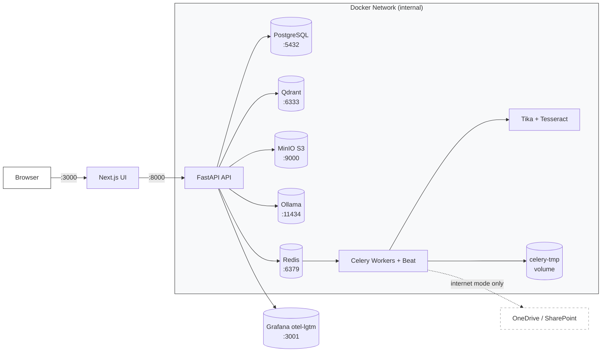

# Gideon Architecture

## Deployment Model

Single-tenant. One Gideon instance per firm. Two modes:

- **Air-gapped**: manual upload only, no external network calls
- **Internet-accessible**: firm-controlled server or private cloud VPC; enables optional scheduled cloud storage ingestion

Only port **3000** (Next.js UI) is exposed to the host. All backend services and the API communicate over the internal Docker network. **FastAPI is never exposed on a public port.**

---

## Service Layers

The backend is organized into **9 service layers**, each with a distinct responsibility. Data flows through layers in a clear direction: HTTP request enters at the API layer, passes through Auth & Permissions, delegates to domain-specific layers (Data, Storage, Vector, Worker, RAG), and returns a response.

| Layer | Module(s) | Responsibility |
| --- | --- | --- |
| **UI** | (Next.js — not yet implemented) | Browser UI, session cookie auth, httpOnly security, SSE stream forwarding |
| **API** | `app/api/` | Thin FastAPI routers; request validation; delegates to service layers |
| **Auth & Permissions** | `app/core/` (`auth.py`, `permissions.py`, audit) | JWT creation/validation, MFA (TOTP), RBAC, `build_permission_filter()` (security-critical) |
| **Data** | `app/db/` | SQLAlchemy async ORM, relational models (matters, documents, users, audit log) |
| **Storage** | `app/storage/` | S3-compatible object store for original documents (MinIO) |
| **Vector** | `app/vectorstore/`, `app/embedding/` | Vector embeddings via Ollama; Qdrant upsert/search; permission-filter enforcement |
| **Worker** | `app/workers/`, `app/ingestion/`, `app/extraction/`, `app/chunking/` | Celery task execution; ingestion pipeline orchestration; document parsing (Tika/Tesseract) and chunking |
| **RAG** | `app/rag/` | End-to-end retrieval-augmented generation: query embedding, vector search, LLM inference, citations, audit |
| **Observability** | `app/core/metrics.py`, `app/core/telemetry.py` | OpenTelemetry traces, metrics, logs (all on-premise; no external collection) |

### Key Abstractions

- **`build_permission_filter()`** (`core/permissions.py`) — The most security-critical function. Called on every vector query without exception. Enforces role-based access, Jencks material filtering, and matter-scoped results. Never accepts client-supplied filter parameters.
- **`TASK_REGISTRY`** (`workers/registry.py`) — Whitelist of allowed background tasks. Prevents arbitrary task submission.
- **`TaskBroker`** (`workers/broker.py`) — Abstraction around Celery for submitting tasks and polling results.
- **`IngestionService`** (`ingestion/`) — API-to-worker bridge. Dispatches documents to the Celery ingestion pipeline.

---

## Data Flows

The system has **5 major data flows**. Each flow traces through multiple service layers and is documented in its own file:

1. **[Document Ingestion](flows/ingestion.md)** — Upload → parsing → chunking → vectorization → storage
2. **[RAG Query](flows/rag-query.md)** — User question → retrieval → LLM call → citations → audit log
3. **[Authentication](flows/authentication.md)** — Login → JWT creation → session → MFA verification
4. **[Permission Filtering](flows/permission-filtering.md)** — Query → `build_permission_filter()` → matter-scoped results
5. **[Background Jobs](flows/background-jobs.md)** — Task submission → Celery worker → completion → audit

Each flow document includes: prose description, Mermaid sequence diagram, step-by-step walkthrough, decision points, and error handling.

---

## Permission Model

### Roles

| Role | Work product | Jencks | Matter access |
| --- | --- | --- | --- |
| Admin | Yes | Yes | All matters |
| Attorney | Yes | Yes | Assigned matters |
| Paralegal | If `view_work_product` granted | Yes | Assigned matters |
| Investigator | No | No | Assigned matters |

### Jencks Rule

Jencks material (prior statements of government witnesses) is excluded from all queries until `has_testified = true` is set on the witness record for that matter. This flag lives in PostgreSQL and is checked inside `build_permission_filter()` on every vector query.

### Vector Payload

Every vector chunk in Qdrant carries a permission payload:

```json
{
  "firm_id": "uuid",
  "matter_id": "uuid",
  "client_id": "uuid",
  "document_id": "uuid",
  "chunk_index": 0,
  "classification": "brady|giglio|jencks|rule16|work_product|inculpatory|unclassified",
  "source": "government_production|defense|court|work_product",
  "bates_number": "string|null",
  "page_number": 4
}
```

---

## Security Invariants

Each invariant is enforced by a specific service layer:

1. **No third-party LLM API calls** → RAG layer (Ollama only)
2. **No model training on client data** → RAG layer (zero-retention inference)
3. **No external telemetry** → Observability layer (on-premise only)
4. **`build_permission_filter()` on every vector query** → Auth & Permissions layer (enforced before all Qdrant searches)
5. **Legal hold = immutable documents** → Storage layer (deletion blocked on held documents)
6. **SHA-256 hash on every ingested document** → Storage layer (deduplication + integrity)
7. **Immutable hash-chained audit log** → Auth & Permissions layer
8. **MFA enforced for all users** → Auth & Permissions layer
9. **Encryption at rest and in transit** → All layers (configured externally)

---

## Background Jobs

| Job | Schedule | Purpose | Layer |
| --- | --- | --- | --- |
| Cloud ingestion | Every 15 min | Poll Graph API, ingest, delete temp files | Worker |
| Deadline monitor | Every 1 hour | CPL 245 and CPL 30.30 clock alerts | Worker |
| Audit chain validator | Nightly | Verify hash chain integrity | Auth & Permissions |
| Legal hold enforcer | Continuous | Block deletion on held documents | Storage |

**Temp file handling:** Celery worker uses an ephemeral named volume (`celery-tmp`). Each file is deleted immediately after ingestion completes or fails. A startup cleanup job wipes orphaned files from any previous crashed run.

---

## Document Storage

All original files are stored in MinIO (S3-compatible object storage) regardless of ingestion source. This gives Gideon full control over document lifecycle, including legal hold enforcement.

### Bucket Layout

```text
gideon/
  {firm_id}/
    {matter_id}/
      {document_id}/original.{ext}
```

### Storage Rules

- Original file is preserved as-is — never modified
- Legal hold is enforced at this layer: held documents cannot be deleted or overwritten
- Both manual uploads and cloud-ingested files end up here
- SharePoint document libraries only; personal OneDrive drives are out of scope
- SharePoint is read-only — Gideon never writes back to cloud storage

---

## Hardware Requirements

| Tier | RAM | CPU | Storage | GPU |
| --- | --- | --- | --- | --- |
| Minimum (CPU-only) | 32 GB | 8 cores | 500 GB | None |
| Recommended | 32 GB | 8 cores | 500 GB | NVIDIA 16+ GB VRAM |

GPU is a performance upgrade, never a prerequisite.

---

## Vendor & Infrastructure Notes

The following vendor/technology choices support the service layers above:

| Vendor | Layer | Purpose |
| --- | --- | --- |
| PostgreSQL | Data | Relational models (matters, documents, users, audit log) |
| MinIO | Storage | S3-compatible object store for original documents |
| Qdrant | Vector | Vector database for embeddings; single collection, permission-filtered |
| Ollama | Vector, RAG | Local LLM + embeddings (Llama 3 8B / Mistral 7B; nomic-embed-text) |
| Apache Tika | Worker | Document text extraction + OCR (Tesseract) |
| Redis | Worker | Celery broker (task queue) |
| Celery | Worker | Background task execution + scheduling (Beat) |
| Grafana otel-lgtm | Observability | OpenTelemetry traces (Tempo), metrics (Prometheus), logs (Loki), UI (Grafana) |
| Next.js | UI | Web UI, session management, httpOnly cookie auth |

**LangChain runs inside FastAPI as a library** — not a separate service.

---

## Deployment Architecture


