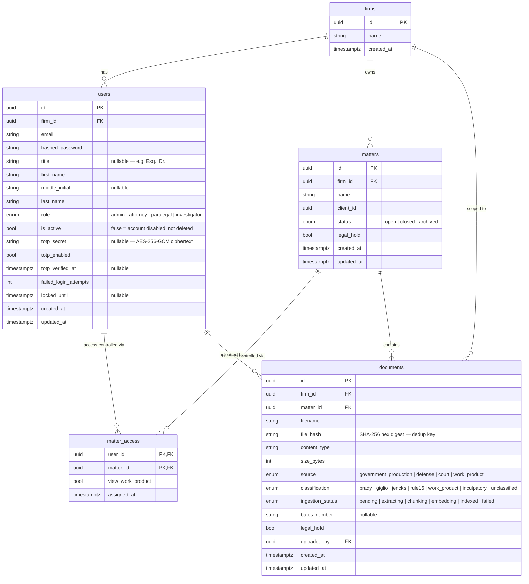
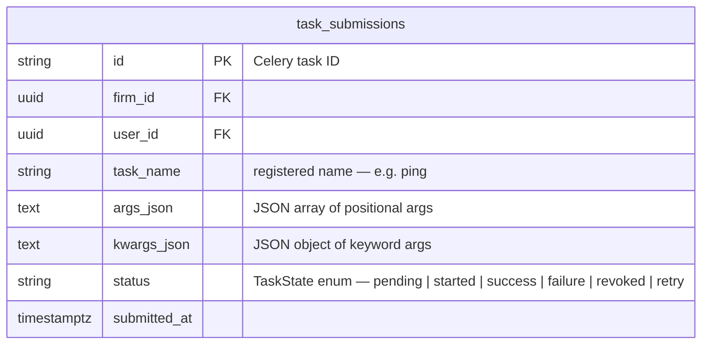
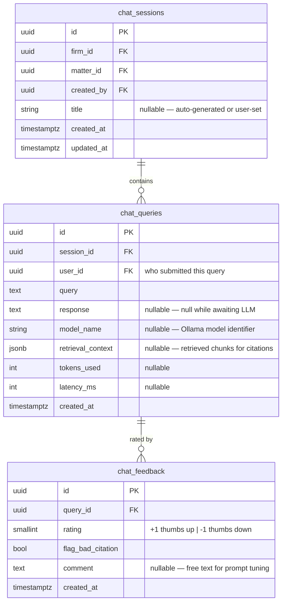

# Gideon — Entity Relationship Diagram

Covers tables through Feature 7.1. Tables from later features
(audit_log, witnesses, disclosure_checklist, etc.) will be added
as each feature lands.

## Core Schema

## Worker Queue Schema

`firm_id` and `user_id` are FKs to the Core Schema `firms` and `users` tables.

## Chat Schema

`firm_id` and `matter_id` on `chat_sessions` are FKs to the Core Schema.
`firm_id` and `matter_id` are not stored on `chat_queries` — derivable via
`JOIN chat_sessions`. `user_id` on `chat_feedback` is not stored — derivable
via `JOIN chat_queries`.

## Key Constraints

| Table | Constraint | Rule |
| --- | --- | --- |
| `users` | `uq_users_firm_id_email` | Email unique per firm (same email can exist across firms) |
| `users` | `fk_users_firm_id_firms` | Cascades on firm delete |
| `matters` | `fk_matters_firm_id_firms` | Cascades on firm delete |
| `matter_access` | Composite PK `(user_id, matter_id)` | One access row per user/matter pair |
| `matter_access` | `fk_matter_access_user_id_users` | Cascades on user delete |
| `matter_access` | `fk_matter_access_matter_id_matters` | Cascades on matter delete |
| `documents` | `uq_documents_matter_id_file_hash` | Same file (by SHA-256) within same matter is rejected |
| `documents` | `fk_documents_firm_id_firms` | Cascades on firm delete |
| `documents` | `fk_documents_matter_id_matters` | Cascades on matter delete |
| `documents` | `fk_documents_uploaded_by_users` | Cascades on user delete |
| `task_submissions` | `fk_task_submissions_firm_id_firms` | Cascades on firm delete |
| `task_submissions` | `fk_task_submissions_user_id_users` | Cascades on user delete |
| `task_submissions` | `ix_task_submissions_firm_id` | Index on `firm_id` for firm-scoped queries |
| `task_submissions` | `ix_task_submissions_task_name` | Index on `task_name` for filtering |
| `chat_sessions` | `fk_chat_sessions_firm_id_firms` | Cascades on firm delete |
| `chat_sessions` | `fk_chat_sessions_matter_id_matters` | Cascades on matter delete |
| `chat_sessions` | `fk_chat_sessions_created_by_users` | Cascades on user delete |
| `chat_queries` | `fk_chat_queries_session_id_chat_sessions` | Cascades on session delete |
| `chat_queries` | `fk_chat_queries_user_id_users` | Cascades on user delete |
| `chat_feedback` | `uq_chat_feedback_query_id` | One feedback row per query |
| `chat_feedback` | `ck_chat_feedback_rating` | Rating must be -1 or +1 |
| `chat_feedback` | `fk_chat_feedback_query_id_chat_queries` | Cascades on query delete |

## Notes

- All primary keys are UUID v4 — no sequential integers exposed to clients.
- `totp_secret` stores AES-256-GCM ciphertext only — plaintext is never persisted.
- `legal_hold` on a matter blocks document deletion in all downstream services
  (MinIO, Qdrant, Postgres) — enforced by the Legal Hold Celery task (Feature 12).
- `matter_access` is a **security construct**, not a business join table. It is
  checked by `build_qdrant_filter()` on every vector query. A missing row means
  404, not 403 — matter existence is not revealed to unauthorized users.
- `view_work_product` defaults to `false` for all access rows. Only Admin can grant
  it to Paralegal users; Investigators can never receive it (enforced in RBAC layer).
- `role` on `users` is a PostgreSQL native enum (`user_role`). Four roles are fixed
  by design — no `user_roles` lookup table. Roles are a closed set defined by the
  permission model, not operator-configurable data.
- `client_id` is a UUID reference to a client record. The clients table will be
  introduced in a later feature; for now it is stored as a bare UUID.
- `task_submissions.id` is the Celery task ID (a string, not a UUID). The
  primary key is assigned by Celery at submission time.
- `task_submissions.status` is denormalized from the Celery result backend and
  updated on read via `GET /tasks/{task_id}`.
- `chat_queries.retrieval_context` is JSONB with a suggested shape:
  `{"chunks": [{"document_id": "...", "chunk_index": 0, "text": "...",`
  `"score": 0.87}]}`. The exact structure is finalized in Feature 7.5
  (citation assembly).
- `chat_queries.response` is nullable — null while the LLM is generating a response.
  The row is inserted at query time and updated when inference completes.
