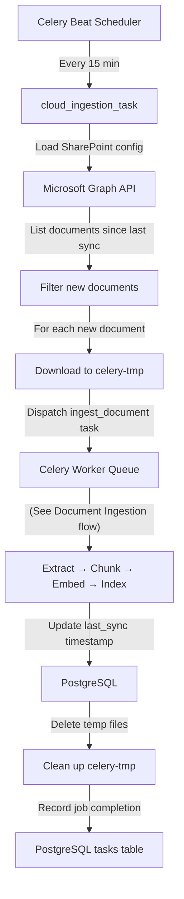
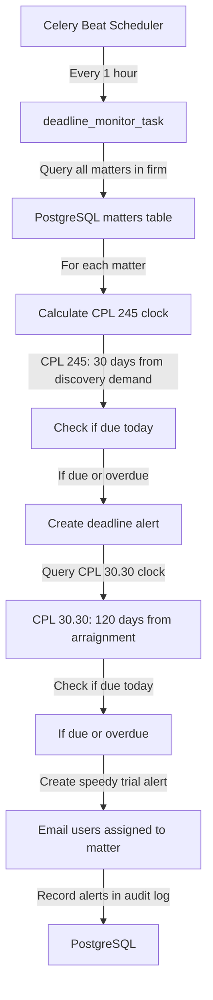
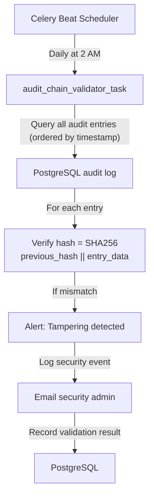
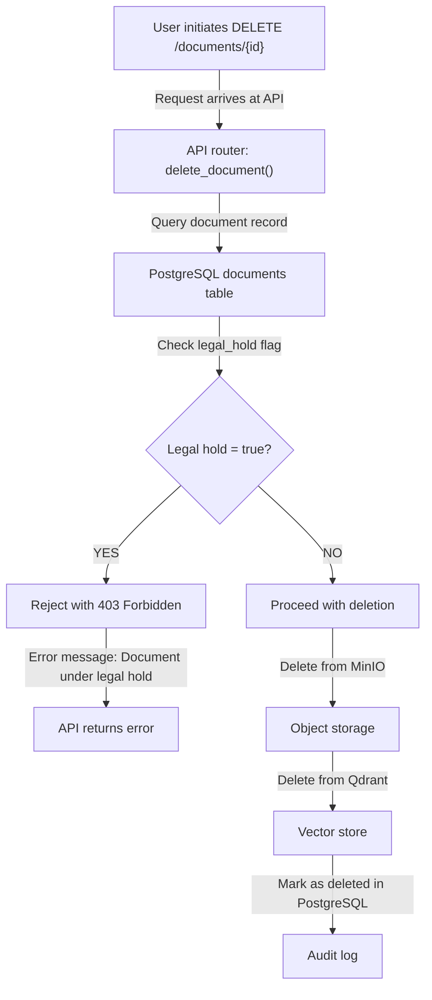

# Data Flow: Background Jobs

**Overview:** Gideon runs 4 recurring background jobs via Celery Beat to handle asynchronous tasks: cloud document ingestion, deadline monitoring, audit log validation, and legal hold enforcement. These jobs ensure the knowledge base stays fresh, critical dates don't slip, and compliance invariants are maintained.

---

## Job Schedule

| Job | Schedule | Purpose | Layer |
| --- | --- | --- | --- |
| Cloud Ingestion | Every 15 min | Poll SharePoint/OneDrive, ingest new files | Worker |
| Deadline Monitor | Every 1 hour | CPL 245 and CPL 30.30 clock alerts | Worker |
| Audit Chain Validator | Nightly (2 AM) | Verify hash-chain integrity | Auth & Permissions |
| Legal Hold Enforcer | Continuous (Celery task) | Block deletion of held documents | Storage |

---

## Job 1: Cloud Ingestion (Every 15 Minutes)

### High-Level Sequence



### Step-by-Step: Cloud Ingestion

#### 1. Scheduler Triggers Task (Celery Beat)

```python
# In workers/tasks/cloud_ingestion.py
from celery import shared_task

@shared_task
def cloud_ingestion_worker():
    """
    Poll SharePoint/OneDrive for new documents.
    Runs every 15 minutes via Celery Beat.
    """
    logger.info("Cloud ingestion job started")
    try:
        # ... (see steps below)
        return {"status": "success", "documents_ingested": 5}
    except Exception as e:
        logger.error(f"Cloud ingestion job failed: {e}")
        # Send alert to admin
        send_alert(f"Cloud ingestion failed: {e}")
```

#### 2. Load Configuration

```python
# Load firm's Cloud ingestion config
firm_id = get_current_firm()  # From context
config = await db.query(CloudIngestionConfig).filter_by(
    firm_id=firm_id,
    enabled=True
).first()

if not config:
    logger.info(f"Cloud ingestion disabled for firm {firm_id}")
    return

# Validate access token freshness
if config.access_token_expires_at < datetime.utcnow():
    # Refresh token using Microsoft Graph
    config.access_token = refresh_access_token(config.refresh_token)
    config.access_token_expires_at = datetime.utcnow() + timedelta(hours=1)
    db.add(config)
    db.commit()
```

#### 3. Query SharePoint for New Documents

```python
# Call Microsoft Graph API
since = config.last_sync_timestamp or datetime.utcnow() - timedelta(days=90)

graph_response = await graph_client.list_documents(
    site_id=config.sharepoint_site_id,
    drive_id=config.sharepoint_drive_id,
    modified_since=since
)

new_documents = [
    doc for doc in graph_response
    if doc['lastModifiedDateTime'] > since
]

logger.info(f"Found {len(new_documents)} new documents")
```

#### 4. Download & Dispatch for Ingestion

```python
# For each new document
for graph_doc in new_documents:
    try:
        # Download to ephemeral volume
        tmp_path = f"/tmp/celery/{uuid4()}/{graph_doc['name']}"
        os.makedirs(os.path.dirname(tmp_path), exist_ok=True)

        file_content = await graph_client.download_file(graph_doc['id'])
        with open(tmp_path, 'wb') as f:
            f.write(file_content)

        # Create document record in PostgreSQL
        document = Document(
            firm_id=firm_id,
            matter_id=config.matter_id,
            filename=graph_doc['name'],
            classification="unclassified",
            source="cloud_ingestion",
            ingestion_status="pending",
            cloud_source_path=graph_doc['webUrl']
        )
        db.add(document)
        db.flush()

        # Upload to MinIO and dispatch ingestion task
        s3_key = await storage_service.upload_from_path(
            file_path=tmp_path,
            document_id=document.id
        )

        # Dispatch ingestion task (same as manual upload)
        task_broker.submit_task(
            task_name="ingest_document",
            document_id=document.id,
            s3_key=s3_key
        )

        # Clean up temp file
        os.remove(tmp_path)

    except Exception as e:
        logger.error(f"Failed to ingest {graph_doc['name']}: {e}")
        document.ingestion_status = "failed"
        db.add(document)
        db.commit()

# Update last sync timestamp
config.last_sync_timestamp = datetime.utcnow()
db.add(config)
db.commit()

logger.info(f"Cloud ingestion job completed. Dispatched {len(new_documents)} tasks")
```

#### 5. Cleanup & Record Completion

```python
# Remove orphaned temp files (from crashed jobs)
cleanup_temp_files()

# Record job completion (for monitoring)
job_record = CeleryTaskSubmission(
    job_name="cloud_ingestion",
    task_id=request.id,
    status="success",
    completed_at=datetime.utcnow()
)
db.add(job_record)
db.commit()
```

**Security Notes:**

- SharePoint is read-only; Gideon never writes back
- Only SharePoint document libraries are supported (not personal OneDrive)
- Access token is refreshed automatically; never hardcoded
- Downloaded files are immediately deleted after upload to MinIO

---

## Job 2: Deadline Monitor (Every 1 Hour)

### Workflow: Deadline Monitor



### Step-by-Step: Deadline Monitor

#### 1. Query All Matters

```python
@shared_task
def deadline_monitor_task():
    """
    Monitor CPL 245 (discovery demands) and CPL 30.30 (speedy trial).
    Runs every 1 hour.
    """
    logger.info("Deadline monitor started")

    firms = db.query(Firm).all()
    alerts_sent = 0

    for firm in firms:
        matters = db.query(Matter).filter_by(
            firm_id=firm.id,
            closed_at=None  # Only active matters
        ).all()

        for matter in matters:
            # ... (see steps below)
```

#### 2. Calculate CPL 245 Clock

```python
        # CPL 245: Discovery demand deadline
        # 30 days from initial disclosure
        if matter.discovery_demand_date:
            cpl245_due = matter.discovery_demand_date + timedelta(days=30)
            days_until_due = (cpl245_due - datetime.utcnow().date()).days

            if days_until_due <= 3 and days_until_due >= 0:
                # Alert: Due in next 3 days
                alert = DeadlineAlert(
                    matter_id=matter.id,
                    type="cpl245_discovery",
                    due_date=cpl245_due,
                    days_until_due=days_until_due,
                    severity="warning" if days_until_due > 0 else "urgent"
                )
                db.add(alert)
                alerts_sent += 1

            elif days_until_due < 0:
                # OVERDUE
                alert = DeadlineAlert(
                    matter_id=matter.id,
                    type="cpl245_discovery",
                    due_date=cpl245_due,
                    days_until_due=days_until_due,
                    severity="critical",
                    overdue=True
                )
                db.add(alert)
                alerts_sent += 1
```

#### 3. Calculate CPL 30.30 Clock

```python
        # CPL 30.30: Speedy trial (120 days from arraignment)
        if matter.arraignment_date:
            cpl3030_due = matter.arraignment_date + timedelta(days=120)
            days_until_due = (cpl3030_due - datetime.utcnow().date()).days

            if days_until_due <= 7 and days_until_due >= 0:
                # Alert: Due in next 7 days
                alert = DeadlineAlert(
                    matter_id=matter.id,
                    type="cpl3030_speedy_trial",
                    due_date=cpl3030_due,
                    days_until_due=days_until_due,
                    severity="critical"  # Speedy trial is more urgent
                )
                db.add(alert)
                alerts_sent += 1
```

#### 4. Notify Users & Record Alerts

```python
    # For each alert, notify assigned users
    for alert in db.query(DeadlineAlert).filter_by(
        notified_at=None
    ).all():
        matter = alert.matter
        users = db.query(User).join(
            MatterAccess
        ).filter(
            MatterAccess.matter_id == matter.id
        ).all()

        for user in users:
            # Send email notification
            email_service.send_deadline_alert(
                to=user.email,
                matter_name=matter.name,
                deadline_type=alert.type,
                due_date=alert.due_date,
                days_until_due=alert.days_until_due
            )

        alert.notified_at = datetime.utcnow()
        db.add(alert)

    db.commit()
    logger.info(f"Deadline monitor completed. Alerts sent: {alerts_sent}")
```

---

## Job 3: Audit Chain Validator (Nightly, 2 AM)

### Purpose: Audit Validation

Verify the hash-chain integrity of the immutable audit log. Every audit entry includes a `hash` and `previous_hash`, forming a blockchain-like chain. If any entry is tampered with, the chain breaks.

### Workflow: Audit Validation



### Step-by-Step

```python
@shared_task
def audit_chain_validator_task():
    """
    Verify immutable audit log integrity.
    Runs nightly at 2 AM.
    """
    logger.info("Audit chain validation started")

    # Query all audit entries in order
    entries = db.query(AuditLogEntry).order_by(
        AuditLogEntry.created_at.asc()
    ).all()

    if not entries:
        logger.info("No audit entries to validate")
        return

    # Validate chain
    broken_entries = []

    for i, entry in enumerate(entries):
        if i == 0:
            # First entry: hash should equal SHA256(entry_data)
            expected_hash = sha256_hash(entry.serialize())
        else:
            # Subsequent entries: hash = SHA256(previous_hash || entry_data)
            previous_hash = entries[i-1].hash
            expected_hash = sha256_hash(
                previous_hash.encode() + entry.serialize().encode()
            )

        if entry.hash != expected_hash:
            broken_entries.append({
                "entry_id": entry.id,
                "timestamp": entry.created_at,
                "expected_hash": expected_hash,
                "actual_hash": entry.hash
            })

    if broken_entries:
        # SECURITY ALERT: Tampering detected
        logger.critical(f"Audit chain broken at {len(broken_entries)} entries!")

        alert = SecurityAlert(
            type="audit_tampering_detected",
            severity="critical",
            details=broken_entries,
            timestamp=datetime.utcnow()
        )
        db.add(alert)
        db.commit()

        # Email security admin immediately
        email_service.send_security_alert(
            to=security_admin_email,
            subject="CRITICAL: Audit log tampering detected",
            details=broken_entries
        )
    else:
        logger.info(f"Audit chain validation passed. {len(entries)} entries verified")

        validation_record = AuditValidationRecord(
            validated_at=datetime.utcnow(),
            entries_verified=len(entries),
            status="passed"
        )
        db.add(validation_record)
        db.commit()
```

---

## Job 4: Legal Hold Enforcer (Continuous)

### Purpose

Prevent deletion of documents under legal hold. This is enforced at the Storage layer and checked before any DELETE operation.

### Workflow



### Implementation

```python
# In api/documents.py (HTTP route)
@router.delete("/documents/{document_id}")
async def delete_document(
    document_id: str,
    current_user: User = Depends(get_current_user),
    db: AsyncSession = Depends(get_db)
):
    document = await db.query(Document).get(document_id)

    if not document:
        raise 404 Not Found

    # Legal hold check (ENFORCER)
    if document.legal_hold:
        raise 403 Forbidden(
            detail="Document is under legal hold and cannot be deleted"
        )

    # Proceed with deletion
    # 1. Delete from S3
    await storage_service.delete_document(document.s3_key)

    # 2. Delete from Qdrant
    await vector_store.delete_by_document(document.document_id)

    # 3. Mark as deleted in PostgreSQL
    document.deleted_at = datetime.utcnow()
    document.deleted_by_user_id = current_user.id
    db.add(document)

    # 4. Audit log
    await audit_log.record(
        action="document_deleted",
        document_id=document.id,
        user_id=current_user.id,
        timestamp=datetime.utcnow()
    )

    db.commit()

    return {"status": "deleted"}
```

---

## Failure Modes & Recovery

| Failure | Behavior | Recovery |
| --- | --- | --- |
| Cloud ingestion times out | Job fails; retried next cycle (15 min) | Manual retry via API if urgent |
| SharePoint token expires | Job fails; admin notified | Admin re-authorizes in UI |
| Database unavailable | All jobs fail; retried at next scheduled time | DBA restores DB; jobs retry automatically |
| Deadline monitor sends duplicate alerts | User sees duplicate emails | Deduplicate alerts by `(matter_id, type, due_date)` |
| Audit chain validation fails | Security alert sent; job completes | Security team investigates tampering |

---

## Performance & Scalability

- **Cloud Ingestion:** Scales with document count. Large firms (500+ new docs per cycle) may need longer intervals (30 min instead of 15).
- **Deadline Monitor:** ~100 ms per matter. 100 matters = 10 seconds per hour.
- **Audit Chain Validator:** ~10 ms per entry. 1M entries = 10 seconds. Run nightly to avoid slowdown during business hours.
- **Legal Hold Enforcer:** ~5 ms per deletion. Always completes within SLA.

---

## Related Flows

- [Document Ingestion](ingestion.md) — Dispatched by cloud ingestion job
- [Permission Filtering](permission-filtering.md) — Uses matter context for deadline notifications
- [Authentication](authentication.md) — Users authenticated before deletion requests reach Legal Hold Enforcer
