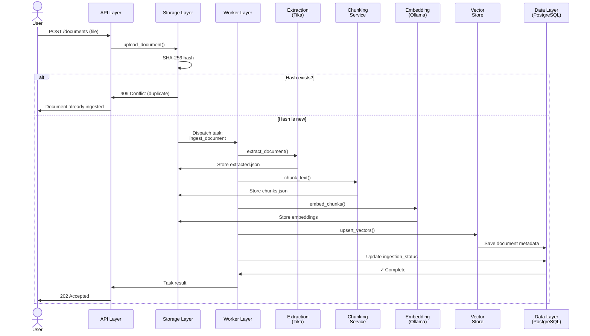

# Data Flow: Document Ingestion

**Overview:** A user uploads a document (manually or via scheduled cloud sync). The system extracts text and metadata, splits it into chunks, generates embeddings, stores everything, and records the metadata. This flow is critical for building the knowledge base that powers RAG queries.

---

## High-Level Sequence



---

## Step-by-Step Walkthrough

### 1. **Upload Request** (API Layer)

User POSTs a document to `POST /documents`:

```json
{
  "matter_id": "uuid",
  "file": <binary file>,
  "classification": "jencks|work_product|unclassified",
  "bates_number": "optional",
  "source": "government_production|defense|court|work_product"
}
```

The API router (`api/documents.py`) validates the request and extracts the file.

### 2. **Deduplication Check** (Storage Layer)

The Storage layer (`storage/s3.py`, `storage/hashing.py`) computes SHA-256 of the file:

```python
file_hash = sha256_hash(file_content)
if file_hash_exists_in_db:
    return 409 Conflict  # Duplicate
```

**Decision Point:** If the exact same file (byte-for-byte) has been ingested before, reject with 409. This prevents wasting compute on re-processing.

**Why SHA-256?** Deterministic, collision-resistant, and industry-standard. Used for both deduplication and document integrity verification.

### 3. **Store Original Document** (Storage Layer)

Upload the original file to MinIO:

```
gideon/{firm_id}/{matter_id}/{document_id}/original.{ext}
```

Store metadata in PostgreSQL: filename, content-type, file_hash, ingestion_status = "pending".

### 4. **Dispatch Ingestion Task** (Worker Layer)

The ingestion service (`ingestion/service.py`) dispatches a Celery task:

```python
task_broker.submit_task(
    task_name="ingest_document",
    document_id=document_id,
    s3_key="gideon/{firm_id}/{matter_id}/{document_id}/original.pdf"
)
```

The task is enqueued to Redis and returned to the user as 202 Accepted with a task ID for polling.

### 5. **Extract Text & Metadata** (Worker Layer → Extraction Service)

The Celery worker runs `workers/tasks/ingest_document.py`, which calls `extraction/tika.py`:

```python
result = await TikaExtractionService.extract_document(
    file_path=s3_key,
    max_file_size_mb=settings.extraction.max_file_size_mb
)
# Returns:
# {
#   "text": "extracted text...",
#   "metadata": {"author": "...", "creation_date": "..."},
#   "content_type": "application/pdf",
#   "ocr_applied": true,
#   "language": "en"
# }
```

**Extraction Details:**
- Uses Apache Tika REST server to extract text and metadata
- Detects content-type; auto-detects language
- Runs OCR (Tesseract) if enabled and document is image-heavy
- Emits OpenTelemetry spans and metrics
- **Error handling:** If extraction fails (timeout, invalid file), set ingestion_status = "failed" and log error

Store the raw extraction result as `extracted.json` in MinIO.

### 6. **Chunk Text** (Worker Layer → Chunking Service)

The worker calls `chunking/service.py`:

```python
chunks = await ChunkingService.chunk_text(
    text=extracted_text,
    strategy="recursive",  # LangChain-style recursive splitting
    chunk_size=512,
    chunk_overlap=50
)
# Returns list of ChunkResult objects:
# [
#   {"text": "chunk 1", "char_start": 0, "char_end": 512},
#   {"text": "chunk 2", "char_start": 462, "char_end": 974},
#   ...
# ]
```

**Chunking Details:**
- Uses recursive character splitting with configurable separators (`\n\n`, `\n`, ` `, `)
- Tracks character offsets (char_start, char_end) for hit highlighting in the UI
- Respects chunk_overlap to preserve context across chunk boundaries
- **Error handling:** If chunking fails, set ingestion_status = "failed" and log error

Store the chunks as `chunks.json` in MinIO.

### 7. **Generate Embeddings** (Worker Layer → Embedding Service)

The worker calls `embedding/service.py`:

```python
embeddings = await EmbeddingService.embed_chunks(
    chunks=chunks,
    model="nomic-embed-text",
    batch_size=32
)
# Returns list of EmbeddingResult objects:
# [
#   {"text": "chunk 1", "vector": [0.1, 0.2, 0.3, ..., 768 dims], "chunk_index": 0},
#   ...
# ]
```

**Embedding Details:**
- Batches chunk texts to Ollama's `/api/embed` endpoint (default model: `nomic-embed-text`, 768 dims)
- Validates each vector has exactly the expected dimension count
- Emits OpenTelemetry metrics (embedding latency, batch size)
- **Error handling:** If Ollama is unreachable or returns invalid embeddings, set ingestion_status = "failed" and log error

Store embeddings (vectors) in memory; do not persist to S3 (they are stored in Qdrant).

### 8. **Upsert Vectors & Permission Payload** (Worker Layer → Vector Store)

The worker calls `vectorstore/service.py`:

```python
await vector_store.upsert_vectors(
    embeddings=embeddings,
    document_metadata={
        "firm_id": firm_id,
        "matter_id": matter_id,
        "document_id": document_id,
        "classification": classification,
        "source": source,
        "bates_number": bates_number,
        "page_number": page_number,  # if applicable
        "file_hash": file_hash
    }
)
```

For each chunk and its embedding, Qdrant stores a `PointStruct`:

```json
{
  "id": "uuid",
  "vector": [0.1, 0.2, ..., 768 dims],
  "payload": {
    "firm_id": "uuid",
    "matter_id": "uuid",
    "client_id": "uuid",
    "document_id": "uuid",
    "chunk_index": 0,
    "chunk_text": "chunk text...",
    "char_start": 0,
    "char_end": 512,
    "classification": "jencks|work_product|...",
    "source": "government_production|defense|...",
    "bates_number": "optional",
    "page_number": 4,
    "file_hash": "sha256_hash"
  }
}
```

Qdrant batches upserts in groups of 100 for efficiency.

**Security Invariant:** The permission payload travels with every vector. Later, when users query, `build_permission_filter()` uses this payload to enforce access control (see [Permission Filtering](permission-filtering.md)).

### 9. **Record Metadata in PostgreSQL** (Worker Layer → Data Layer)

The worker updates the `documents` table:

```sql
UPDATE documents
SET
  ingestion_status = 'indexed',
  extracted_text = '...',
  chunk_count = 42,
  embedding_model = 'nomic-embed-text',
  extracted_at = NOW(),
  indexed_at = NOW()
WHERE document_id = ?
```

Also create audit log entries for each pipeline stage.

### 10. **Complete & Return Task Result** (Worker Layer → API Layer)

The task completes successfully. The API returns the task result to the client:

```json
{
  "task_id": "uuid",
  "status": "success",
  "result": {
    "document_id": "uuid",
    "ingestion_status": "indexed",
    "chunk_count": 42,
    "embedding_model": "nomic-embed-text",
    "extracted_at": "2024-01-15T10:30:00Z",
    "indexed_at": "2024-01-15T10:32:15Z"
  }
}
```

---

## Key Decision Points

1. **Deduplication:** SHA-256 hash check prevents re-processing of identical files. If a duplicate is detected, reject immediately with 409.

2. **Extraction Timeout:** If Tika takes too long (configurable max), fail the document and log the error.

3. **Chunking Strategy:** LangChain's recursive splitting is used. Alternative strategies (semantic chunking) are deferred to V2.

4. **Embedding Batch Size:** Ollama is batched for efficiency. If a batch fails, the entire document fails (no partial indexing).

5. **Qdrant Upsert:** Vectors are upserted, not inserted. Duplicate vectors (same chunk_index) are overwritten.

---

## Error Handling

If any stage fails:

1. Set `ingestion_status = "failed"` in PostgreSQL
2. Log the error with full stack trace
3. Emit an OpenTelemetry error span
4. Update the task result with error details
5. **Do not** partially index — if embedding fails, chunks are not stored in Qdrant

Example error response:

```json
{
  "task_id": "uuid",
  "status": "failed",
  "error": "Ollama embedding service unreachable",
  "stage": "embedding"
}
```

---

## Performance Considerations

- **Extraction:** Depends on document size and Tika server response time. Large PDFs (100+ MB) or image-heavy docs (heavy OCR) can take 1-10 minutes.
- **Chunking:** Usually <1 second for typical documents.
- **Embedding:** Scales with chunk count. A 50-page PDF with 100 chunks takes ~2-5 seconds at 32-batch size with Ollama.
- **Vector Upsert:** Qdrant batches 100 vectors per request; large documents are linearized into multiple batches.

**Temp File Cleanup:** Documents are downloaded from MinIO to the ephemeral `celery-tmp` volume, processed, and deleted immediately. A startup cleanup job removes orphaned temp files from crashed workers.

---

## Legal & Security Implications

- **Legal Hold:** A document under legal hold cannot be deleted (enforced at the Storage layer). However, it can still be ingested.
- **Work Product:** Documents marked as "work_product" are invisible to Investigators and Paralegals without `view_work_product` permission (enforced in RAG queries via `build_permission_filter()`).
- **Audit Log:** Every ingestion stage (extraction, chunking, embedding, upsert) is logged with timestamps and actor identity.

---

## Related Flows

- [RAG Query](rag-query.md) — How ingested documents are retrieved and used to answer user questions
- [Permission Filtering](permission-filtering.md) — How permission payloads enforce access control
- [Background Jobs](background-jobs.md) — Scheduled cloud ingestion that uses this flow
