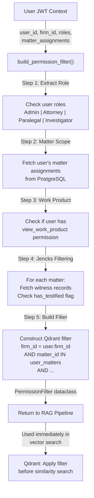

# Data Flow: Permission Filtering

**Overview:** Before any vector search (RAG query, document review, discovery analysis), `build_permission_filter()` enforces role-based and matter-scoped access control. This is the most security-critical function in Gideon. It ensures that users can only query vectors (document chunks) they are authorized to access.

---

## Why This Flow Matters

Gideon stores 11 billion+ vectors (for a large firm) in a single Qdrant collection. Without strict filtering, a compromised JWT or a malicious actor could retrieve any document in the firm. `build_permission_filter()` is the **only place** access control is enforced for vector queries. It is called on **every** vector search without exception and never accepts client-supplied filter parameters.

---

## Conceptual Model

### Vector Payload Structure

Every vector chunk in Qdrant carries a permission payload:

```json
{
  "firm_id": "00000000-1111-2222-3333-000000000001",
  "matter_id": "aaaaaaaa-bbbb-cccc-dddd-eeeeeeeeeeee",
  "client_id": "xxxxxxxx-yyyy-zzzz-wwww-vvvvvvvvvvvv",
  "document_id": "dddddddd-eeee-ffff-0000-111111111111",
  "chunk_index": 0,
  "classification": "jencks|giglio|brady|rule16|work_product|inculpatory|unclassified",
  "source": "government_production|defense|court|work_product",
  "bates_number": "GOV-001",
  "page_number": 4
}
```

### User Context (from JWT)

The authenticated user carries:

```json
{
  "user_id": "uuuuuuuu-vvvv-wwww-xxxx-yyyyyyyyyyyy",
  "email": "attorney@firm.com",
  "firm_id": "00000000-1111-2222-3333-000000000001",
  "roles": ["attorney"],
  "matter_assignments": [
    "aaaaaaaa-bbbb-cccc-dddd-eeeeeeeeeeee",  // Matter 1
    "bbbbbbbb-cccc-dddd-eeee-ffffffffffff"   // Matter 2
  ]
}
```

### Goal

Transform user context into a **Qdrant filter** that restricts vectors to:
1. The user's firm only (multi-tenant isolation)
2. The user's assigned matters (or all if admin)
3. Document classifications the user can see (exclude work_product if not allowed, exclude jencks if witness hasn't testified)

---

## High-Level Sequence



---

## Step-by-Step Walkthrough

### 1. **Extract Role from JWT**

The user's JWT contains `roles` (e.g., `["attorney"]`). `build_permission_filter()` reads this:

```python
def build_permission_filter(
    user: User,  # User object with roles, matter_assignments
    matter_id: str,  # Specific matter being queried
    db: AsyncSession
) -> PermissionFilter:
    """
    Build a Qdrant filter enforcing role-based and matter-scoped access.
    SECURITY CRITICAL: Called on every vector query. Never bypassed.
    """

    # 1. Determine role and base permissions
    roles = [role.name for role in user.roles]  # e.g., ["attorney"]

    if "admin" in roles:
        can_access_all_matters = True
        can_view_work_product = True
        can_view_jencks = True
    elif "attorney" in roles:
        can_access_all_matters = False
        can_view_work_product = True
        can_view_jencks = True
    elif "paralegal" in roles:
        can_access_all_matters = False
        can_view_work_product = user.has_permission("view_work_product")
        can_view_jencks = True
    elif "investigator" in roles:
        can_access_all_matters = False
        can_view_work_product = False
        can_view_jencks = False
    else:
        raise 403 Forbidden  # Unknown role
```

**Role Definitions:**

| Role | Access | Work Product | Jencks |
|------|--------|--------------|--------|
| Admin | All matters in firm | Yes | Yes |
| Attorney | Assigned matters | Yes | Yes |
| Paralegal | Assigned matters | If granted | Yes |
| Investigator | Assigned matters | No | No |

### 2. **Fetch Matter Assignments** (from PostgreSQL)

If the user is not an admin, fetch their assigned matters:

```python
    # 2. Get matter scope
    if can_access_all_matters:
        authorized_matters = await db.query(Matter).filter_by(
            firm_id=user.firm_id
        ).all()
        authorized_matter_ids = [m.id for m in authorized_matters]
    else:
        # User can only access assigned matters
        assignments = await db.query(MatterAccess).filter_by(
            user_id=user.id
        ).all()
        authorized_matter_ids = [a.matter_id for a in assignments]

    if not authorized_matter_ids:
        # User has no matter assignments
        # Return an impossible filter (no vectors match)
        return PermissionFilter(
            firm_id=user.firm_id,
            matter_ids=[],  # Empty list → no results
            exclude_work_product=True,
            exclude_jencks=True
        )
```

**Why PostgreSQL?** Matter assignments change frequently (users added/removed from matters). Querying the DB ensures freshness. (Caching these lookups is a V2 optimization.)

### 3. **Check Work Product Permission**

For paralegals, check if they have `view_work_product` permission:

```python
    # 3. Work product filtering
    if can_view_work_product:
        exclude_work_product = False  # Can see work_product chunks
    else:
        exclude_work_product = True  # Hide work_product chunks
```

Work product is strictly attorney-client privileged content. Investigators and paralegals (without explicit permission) should never see it.

### 4. **Check Jencks Material Filtering**

Jencks material (prior statements of government witnesses) is special under the Jencks Act. It can only be disclosed after the witness has testified:

```python
    # 4. Jencks filtering (per-matter, per-witness)
    jencks_exclusions = {}  # matter_id -> True if exclude jencks

    if can_view_jencks:
        # Admins and attorneys see all jencks material
        for matter_id in authorized_matter_ids:
            jencks_exclusions[matter_id] = False
    else:
        # Paralegals and Investigators: check each witness's status
        for matter_id in authorized_matter_ids:
            witnesses = await db.query(Witness).filter_by(
                matter_id=matter_id
            ).all()

            # If any witness has testified, show jencks
            any_testified = any(w.has_testified for w in witnesses)

            jencks_exclusions[matter_id] = not any_testified
            # Logic: if no witness has testified, exclude jencks
```

**Example:**
- Matter A has Witness 1, who has testified → `jencks_exclusions[A] = False` (show Jencks)
- Matter B has Witness 2, who has NOT testified → `jencks_exclusions[B] = True` (hide Jencks)

### 5. **Build Qdrant Filter** (Final Step)

Combine all constraints into a Qdrant filter:

```python
    # 5. Construct Qdrant filter
    from qdrant_client.models import Filter, FieldCondition, MatchValue

    filter_conditions = []

    # Always enforce firm isolation
    filter_conditions.append(
        FieldCondition(
            key="firm_id",
            match=MatchValue(value=str(user.firm_id))
        )
    )

    # Restrict to authorized matters
    filter_conditions.append(
        FieldCondition(
            key="matter_id",
            match=MatchAny(
                any=[MatchValue(value=str(mid)) for mid in authorized_matter_ids]
            )
        )
    )

    # Work product filtering
    if exclude_work_product:
        filter_conditions.append(
            FieldCondition(
                key="classification",
                match=MatchExcept(
                    except_value=MatchValue(value="work_product")
                )
            )
        )

    # Jencks filtering (per-matter)
    jencks_filters = []
    for matter_id, exclude in jencks_exclusions.items():
        if exclude:
            jencks_filters.append(
                Filter(
                    must=[
                        FieldCondition(
                            key="matter_id",
                            match=MatchValue(value=str(matter_id))
                        ),
                        FieldCondition(
                            key="classification",
                            match=MatchExcept(
                                except_value=MatchValue(value="jencks")
                            )
                        )
                    ]
                )
            )

    # Combine all filters with AND (must) logic
    final_filter = Filter(
        must=filter_conditions,
        should=jencks_filters  # OR logic for per-matter jencks
    )

    return final_filter
```

### 6. **Pass Filter to Vector Search**

The RAG pipeline uses this filter immediately:

```python
# In rag/pipeline.py
permission_filter = build_permission_filter(user, matter_id, db)

# Apply to Qdrant search
results = await vector_store.search(
    query_vector=query_vector,
    filter=permission_filter,  # ← ENFORCED HERE
    limit=5
)

# Results are guaranteed to be:
# - In the user's firm (firm_id)
# - In authorized matters (matter_id)
# - Exclude work_product (if user can't view)
# - Exclude jencks (if witness hasn't testified)
```

---

## Security Invariants

### 1. **Never Bypassed**

`build_permission_filter()` is **always** called before a vector search. There are no exceptions:
- If a developer tries to search without it, the code won't compile (it's a required parameter)
- If a rogue actor somehow calls the Qdrant API directly (bypassing FastAPI), they still need the Qdrant filter applied

### 2. **Never Client-Supplied**

Users cannot pass filter parameters in the request body:

```python
# CORRECT: Build filter server-side
@router.post("/chats/")
async def chat(
    request: ChatRequest,  # No filter param!
    current_user: User = Depends(get_current_user)
):
    filter = build_permission_filter(current_user, ...)
    # Use filter

# WRONG: Accepting client-supplied filter (FORBIDDEN!)
@router.post("/chats/")
async def chat(
    request: ChatRequest,
    user_supplied_filter: dict = None,  # ← SECURITY BUG!
):
    filter = user_supplied_filter or build_permission_filter(...)
    # Use filter
```

### 3. **Comprehensive Coverage**

Every classification and source is accounted for:

```python
CLASSIFICATIONS = [
    "jencks",
    "giglio",
    "brady",
    "rule16",
    "work_product",
    "inculpatory",
    "unclassified"
]

SOURCES = [
    "government_production",
    "defense",
    "court",
    "work_product"
]
```

Each is subject to access control rules.

### 4. **No Timing Leaks**

The filter is built identically regardless of whether the user is authorized. This prevents timing attacks (attackers timing how long the filter-building takes to infer whether a matter exists).

---

## Example Scenarios

### Scenario 1: Attorney in Matter A

**User Context:**
- Role: attorney
- Assigned matters: [Matter A]

**Filter Generated:**
```
firm_id = "user's firm"
AND matter_id IN ["Matter A"]
AND classification NOT IN ["... (all are allowed for attorneys)"]
AND (
    (matter_id = "Matter A" AND classification NOT IN ["jencks"]) OR
    (... witness has testified, so jencks allowed ...)
)
```

**Result:** Can query all documents in Matter A, including work_product and jencks material.

### Scenario 2: Paralegal in Matter B (without view_work_product)

**User Context:**
- Role: paralegal
- Assigned matters: [Matter B]
- Permissions: [] (no view_work_product)

**Filter Generated:**
```
firm_id = "user's firm"
AND matter_id IN ["Matter B"]
AND classification NOT IN ["work_product"]
AND (
    (matter_id = "Matter B" AND classification NOT IN ["jencks"]) OR
    (... if witness testified, allow jencks ...)
)
```

**Result:** Can query all documents in Matter B EXCEPT work_product. Jencks depends on witness testimony.

### Scenario 3: Investigator in Matter C

**User Context:**
- Role: investigator
- Assigned matters: [Matter C]

**Filter Generated:**
```
firm_id = "user's firm"
AND matter_id IN ["Matter C"]
AND classification NOT IN ["work_product", "jencks", "giglio", "brady", "rule16"]
AND matter_id = "Matter C" AND classification NOT IN ["jencks"]
```

**Result:** Can query ONLY unclassified and inculpatory documents in Matter C. All privileged and Jencks material is hidden.

---

## Audit & Compliance

Every permission filter is logged:

```python
# core/audit.py
await audit_log.record(
    action="query_permission_filter_built",
    user_id=user.id,
    matter_id=matter_id,
    filter=permission_filter,
    timestamp=datetime.utcnow()
)
```

This allows forensic analysis: "What did user X query on date Y?"

---

## Performance

`build_permission_filter()` typically executes in **50-200ms**:
- Matter assignment lookup: ~20-50ms (DB query + index)
- Witness testimony check: ~20-50ms (per matter, if paralegal/investigator)
- Filter construction: ~10-20ms (in-memory object creation)

For users with many matter assignments (e.g., admins), this can be slower. V2 optimization: cache matter assignments in Redis.

---

## Failure Modes

| Failure | Behavior |
|---------|----------|
| Database unavailable | 503 Service Unavailable; user cannot query (fail-safe) |
| Invalid user role in JWT | 403 Forbidden; unknown role is rejected |
| Matter not found | Filter built with empty matter list; no results returned |
| Witness record corrupt | Conservatively exclude jencks (fail-safe) |

---

## Related Flows

- [RAG Query](rag-query.md) — How this filter is used in vector search
- [Authentication](authentication.md) — How user roles are populated in the JWT
- [Document Ingestion](ingestion.md) — How permission payloads are attached to vectors
