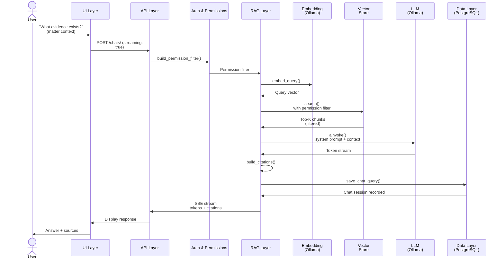

# Data Flow: RAG Query (Chatbot Q&A)

**Overview:** A user asks a question in the context of a matter. The system retrieves relevant ingested documents, uses a local LLM to generate an answer, cites sources, logs the interaction for compliance, and returns the response. This is the flagship feature: matter-scoped Q&A over documents.

---

## High-Level Sequence



---

## Step-by-Step Walkthrough

### 1. **User Submits Question** (UI Layer)

User types a question in the Gideon chat interface. The request specifies:
- Matter context (matter_id is implicit from the session or explicitly provided)
- Question text
- Optional: streaming preference (SSE vs. blocking response)
- Optional: retrieval parameters (top_k, temperature)

### 2. **API Route Handler** (API Layer)

The router (`api/chats.py`) receives the request:

```python
@router.post("/chats/", response_class=StreamingResponse)
async def chat_stream(
    request: ChatRequest,  # question, matter_id, top_k, temperature
    current_user: User = Depends(get_current_user),
    db: AsyncSession = Depends(get_db)
) -> StreamingResponse:
    return StreamingResponse(
        content=rag_pipeline.stream_query(
            question=request.question,
            matter_id=matter_id,
            user=current_user,
            db=db,
            ...
        ),
        media_type="text/event-stream"
    )
```

The router is thin: it extracts the question, user context, and delegates to the RAG pipeline.

### 3. **Permission Filter Check** (Auth & Permissions Layer) — SECURITY CRITICAL

**This is the most important step.** Before searching vectors, `build_permission_filter()` is called:

```python
permission_filter = build_permission_filter(
    user=current_user,
    matter_id=matter_id,
    db=db
)
# Returns a PermissionFilter dataclass:
# {
#   "firm_id": "user's firm_id",
#   "matter_id": "user's assigned matter_id (or all if admin)",
#   "exclude_work_product": false,  # if user has view_work_product
#   "exclude_jencks": true,  # if witness has not testified
# }
```

**Decision Points:**

1. **Role Check:** Is the user's role allowed to access this matter?
   - Admin: can access any matter in the firm
   - Attorney: can access only assigned matters
   - Paralegal: can access only assigned matters (+ work_product restriction)
   - Investigator: can access only assigned matters (+ work_product + Jencks restrictions)

2. **Matter Assignment:** Is the user assigned to this matter?
   - If not, return 403 Forbidden

3. **Work Product Filtering:** Does the user have `view_work_product` permission?
   - If not, exclude all chunks classified as "work_product"

4. **Jencks Filtering:** Has the witness testified?
   - Query the witness record for `has_testified = true`
   - If false, exclude all chunks classified as "jencks"

**Why Security-Critical?** This is the **only place** where access control is enforced for vector queries. If this function is bypassed, the user can query any document in the firm. It is called on **every** vector query without exception and **never accepts client-supplied filter parameters**.

### 4. **Embed the User's Question** (RAG Layer)

The RAG pipeline (`rag/pipeline.py`) calls the embedding service:

```python
query_vector = await embedding_service.embed_query(
    question="What evidence exists?",
    model="nomic-embed-text"
)
# Returns: [0.1, 0.2, 0.3, ..., 768 dimensions]
```

This uses the **same embedding model** that was used to index documents (nomic-embed-text), ensuring semantic consistency.

### 5. **Vector Search with Permission Filter** (Vector Store Layer)

The RAG pipeline calls the vector store:

```python
top_chunks = await vector_store.search(
    query_vector=query_vector,
    permission_filter=permission_filter,  # from step 3
    top_k=5,  # retrieve top 5 chunks
    matter_id=matter_id
)
```

Qdrant executes the search:

```sql
-- Pseudo-query
SELECT * FROM vectors
WHERE
  vector.similarity(query_vector) > threshold
  AND firm_id = permission_filter.firm_id
  AND matter_id = permission_filter.matter_id
  AND (NOT exclude_work_product OR classification != "work_product")
  AND (NOT exclude_jencks OR classification != "jencks")
ORDER BY similarity DESC
LIMIT 5
```

**Returns:** List of `ScoredPoint` objects with full payloads:

```json
[
  {
    "id": "chunk_uuid_1",
    "similarity_score": 0.85,
    "payload": {
      "chunk_text": "Government produced document X...",
      "document_id": "doc_uuid",
      "bates_number": "GOV-001",
      "page_number": 4,
      "classification": "jencks",
      "source": "government_production",
      "char_start": 1000,
      "char_end": 1512
    }
  },
  ...
]
```

**Decision Point:** If no results are found (top_k = 0), the LLM still generates a response, but with no context (it may say "I don't have information on this topic").

### 6. **Assemble LLM Prompt** (RAG Layer)

The RAG pipeline builds a prompt with system context and retrieved chunks:

```python
messages = [
    {
        "role": "system",
        "content": f"""
You are a legal assistant for criminal defense. 
You must cite sources precisely using [Doc Name, Bates #, Page #] format.
Only answer based on the provided documents.
Never make up or infer information.
User's firm: {user.firm_name}
Matter: {matter_name}
        """
    },
    {
        "role": "user",
        "content": f"""
Based on the following documents, answer this question: {question}

RETRIEVED CONTEXT:
1. [GOV-001, p. 4] {top_chunks[0].payload.chunk_text}
2. [GOV-002, p. 12] {top_chunks[1].payload.chunk_text}
...

Question: {question}
        """
    }
]
```

This "retrieval-augmented" prompt provides both constraints (system prompt) and evidence (retrieved chunks).

### 7. **LLM Inference** (RAG Layer via Ollama)

The RAG pipeline calls the local LLM:

```python
llm = ChatOllama(
    model="llama3",
    temperature=0.1,  # low temp → more deterministic
    top_p=0.9,
    base_url="http://ollama:11434",
    num_ctx=4096
)

# Streaming version:
async for token in llm.astream(messages):
    yield f"data: {json.dumps({'token': token})}\n\n"
```

The LLM generates tokens one by one. In streaming mode, tokens are sent to the client via SSE (Server-Sent Events) for real-time display.

**Model Constraints:**
- Default model: Llama 3 8B or Mistral 7B (configurable)
- Context window: 4096 tokens (max 5 chunks + prompt + answer)
- Temperature: 0.1 (deterministic, factual)
- **No fine-tuning on client data**
- **No telemetry sent to external services**

### 8. **Citation Assembly** (RAG Layer)

As tokens are generated, the RAG pipeline post-processes citations:

```python
response_text = "..."  # Full LLM output
citations = extract_citations(response_text)
# Example: "[GOV-001, p. 4]" → {document_id, bates_number, page_number}

# Enrich citations with full metadata:
enriched_citations = [
    {
        "reference": "[GOV-001, p. 4]",
        "document_name": "Grand Jury Transcript",
        "bates_number": "GOV-001",
        "page_number": 4,
        "document_id": "doc_uuid_1",
        "source": "government_production"
    },
    ...
]
```

Citations are returned alongside the response for UI display (typically as clickable links to the document viewer).

### 9. **Persist to Audit Log & Chat History** (Data Layer)

After the response is complete, the RAG pipeline saves the interaction:

```python
chat_session = ChatSession(
    matter_id=matter_id,
    user_id=current_user.id,
    started_at=datetime.now(),
    ...
)
db.add(chat_session)
db.flush()

chat_query = ChatQuery(
    chat_session_id=chat_session.id,
    question=question,
    answer=response_text,
    retrieval_context=[
        {"chunk_text": chunk.text, "similarity": chunk.score}
        for chunk in top_chunks
    ],
    citations=enriched_citations,
    execution_time_ms=elapsed,
    model_used="llama3",
    created_at=datetime.now()
)
db.add(chat_query)
db.commit()
```

This creates:
1. An immutable audit record (for compliance with ABA Rule 1.6)
2. A chat history for the user to review later
3. Metrics for observability (query count, latency, citation accuracy)

### 10. **Return Response to User** (API → UI → Browser)

The API stream completes, and the full response is displayed in the UI:

```json
{
  "status": "complete",
  "answer": "Evidence includes Government Exhibit 001 [GOV-001, p. 4] which states...",
  "citations": [
    {
      "reference": "[GOV-001, p. 4]",
      "document_name": "Grand Jury Transcript",
      "bates_number": "GOV-001",
      "page_number": 4
    }
  ],
  "execution_time_ms": 3200,
  "model": "llama3",
  "tokens_generated": 187
}
```

The UI displays:
- The answer text with citation links
- A list of sources (with links to the document viewer)
- Confidence metadata (model used, execution time)

---

## Key Decision Points

1. **Permission Filter (SECURITY):** Checked **first** and **always**. Never bypassed.

2. **Retrieval Strategy:** Cosine similarity + permissionfilter. Vector DB handles the heavy lifting.

3. **Top-K Parameter:** Default is 5; adjustable per query. More context means higher latency but potentially better answers.

4. **Temperature:** Fixed at 0.1 for legal use (deterministic, factual). Not configurable by the user.

5. **Citation Extraction:** Post-processes LLM output using regex/parsing to identify [Bates #, p. X] patterns and enrich them with metadata.

6. **Streaming vs. Blocking:** Users can choose SSE streaming (real-time tokens) or blocking (wait for full response). Both are audited identically.

---

## Error Handling

If any stage fails:

| Stage | Error | Behavior |
|-------|-------|----------|
| Permission Filter | User not in matter | 403 Forbidden |
| Embedding | Ollama unreachable | 503 Service Unavailable |
| Vector Search | Qdrant timeout | 504 Gateway Timeout; retry with top_k=3 |
| LLM Inference | Ollama crashes | Streaming disconnected; client sees partial response |
| Citation Assembly | Parsing fails | Return answer without citation enrichment |
| Audit Log | DB write fails | Log error; return response (audit is best-effort) |

All errors are emitted as OpenTelemetry spans with full context for observability.

---

## Performance Considerations

- **Embedding:** 10-100 ms (Ollama nomic-embed-text)
- **Vector Search:** 50-200 ms (Qdrant with permission filter)
- **LLM Inference:** 1-10 seconds (depends on model size and response length)
- **Total E2E:** Typically 2-15 seconds for a full response

**Bottleneck:** LLM inference (Ollama token generation). GPU acceleration helps significantly.

---

## Legal & Compliance

- **Audit Trail:** Every query is logged with question, answer, user, matter, timestamp, sources, and execution time.
- **No Data Retention:** LLM does not retain the user's question or the answer. Inference is zero-shot per query.
- **Jencks Filtering:** Automatic exclusion of Jencks material until witness has testified.
- **Work Product:** Automatic exclusion for non-attorney users.
- **Citations:** Required for transparency. User can click through to verify sources.

---

## Related Flows

- [Document Ingestion](ingestion.md) — How documents are processed and embedded for retrieval
- [Permission Filtering](permission-filtering.md) — Deep dive into `build_permission_filter()`
- [Authentication](authentication.md) — How user identity is established before querying
